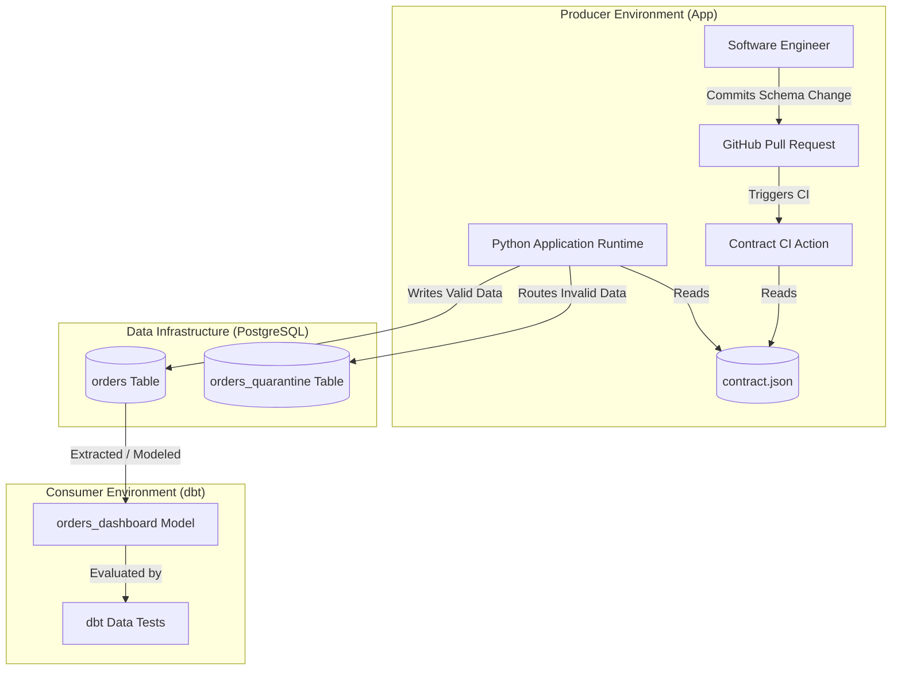

# Comprehensive Architecture Report: Shift-Left Data Contracts

## 1. Executive Summary & Problem Framing

Modern enterprise data stacks suffer from an architectural defect: **late-stage quality detection**. In traditional architectures, application microservices write transactions to operational databases without formal schema agreements with downstream analytics consumers. When an application engineer renames a field (e.g., `currency` to `currency_code`), alters a numeric unit (cents to dollars), adds an unvetted enum status (`refunded`), or omits UTC offsets in timestamps, the change deploys silently.

As Chad Sanderson observes:
> *"By the time a failure has been detected downstream, it's already too late."*
> — Chad Sanderson, *Tackling Data's Biggest Culture Problem*

Downstream data pipelines break, or worse, execute to completion while silently corrupting business metrics. Executive dashboards display sudden revenue drops, machine learning models ingest biased features, and data engineering teams spend 40% of their operational budget on retrospective firefighting.

This project designs, implements, and benchmarks a complete **Shift-Left Data Quality Platform** using **Data Contracts**. By moving contract verification into the producer's Pull Request CI gate and coupling it with application runtime quarantine dead-letter queues, breaking changes are caught before merging or quarantined at write time.



---

## 2. The Three Protection Layers

We evaluate three operational defense architectures:

### Layer 1: Downstream Only (`downstream_only`)
- **Mechanism**: The naive baseline. Producer writes directly to the operational database with no pre-merge schema verification and no runtime validation. Data lands in `orders`, is transformed by downstream dbt models (`orders_dashboard`), and is evaluated during scheduled nightly dbt test runs.
- **Vulnerabilities**:
  - Semantic anomalies (e.g., negative revenue `-50`) pass standard dbt `not_null` and `unique` assertions unnoticed.
  - Timezone format changes (`-05:00` vs UTC) land silently, skewing daily revenue reporting.
  - Stale events (>24h delay) and silent 5-year backfills pass unnoticed.
  - Test data (`id = -1`) passes as unique non-null integers.
  - Even when dbt tests catch an error (e.g., `accepted_values` on `status`), the poisoned row has already landed in the table and broken downstream pipelines.

### Layer 2: Downstream + Contract CI (`downstream_plus_ci`)
- **Mechanism**: Central `contract.json` (JSON Schema Draft-07) acts as the single source of truth. A pre-merge GitHub Actions CI workflow runs `scripts/check_contract.py` on Pull Requests. Any change violating types, enums, required properties, currency regex, UTC timestamps, or freshness SLAs blocks the PR.
- **Strengths**: Catches 11 of 12 breaking changes before code merge (`stage_caught: pull_request`).
- **Limitation**: Pure CI checks cannot inspect runtime database state. Stateful anomalies, such as duplicate primary key insertions across distributed application instances, pass single-payload CI checks and must be handled downstream.

### Layer 3: All Layers (`all_layers` — Defense-in-Depth)
- **Mechanism**:
  1. **Pre-merge CI**: Blocks breaking schema changes at PR.
  2. **Application Runtime Quarantine (`app_writer.py`)**: Validates every incoming write against `contract.json` and database state. Valid records are written to `orders`; invalid or conflicting records are immediately routed to `orders_quarantine` with raw JSONB payload and rejection rationale.
  3. **Downstream dbt Assertions**: Final safety net validating model aggregations.
- **Result**: 100% of breaking changes detected, zero poisoned rows ever reach analytical dashboards.

---

## 3. The 16-Change Catalog Specification

The experiment harness simulates 16 realistic engineering changes across three configurations (48 total scenarios):

| Change ID | Change Type | Nature | Description |
|:---:|:---|:---:|:---|
| **1** | Column rename | Breaking | Key `currency` replaced by `currency_code` |
| **2** | Type change | Breaking | `amount_cents` passed as floating point `150.50` |
| **3** | Semantic change | Breaking | `amount_cents` passed as negative value `-50` |
| **4** | New enum value | Breaking | `status` passed as unapproved value `'refunded'` |
| **5** | Null in required field | Breaking | `customer_id` passed as `None`/`null` |
| **6** | Duplicate IDs | Breaking | State-dependent insertion of duplicate primary key |
| **7** | Timezone change | Breaking | `created_at` formatted with `-05:00` instead of UTC |
| **8** | Dropped column | Breaking | Required key `status` omitted entirely |
| **9** | Silent backfill | Breaking | Historical event inserted with timestamp from 5 years ago |
| **10** | Late data | Breaking | Event arrival timestamp delayed by >24 hours |
| **11** | Currency swap | Breaking | Lowercase ISO string `'gbp'` instead of `'GBP'` |
| **12** | Test data in prod | Breaking | Mock synthetic ID `id = -1` injected into production |
| **13** | New nullable column | Non-Breaking | Optional schema evolution `discount_code: 'SUMMER20'` |
| **14** | Comment/Description change | Non-Breaking | Metadata documentation change in schema contract |
| **15** | Index addition | Non-Breaking | Performance index added to database table |
| **16** | Widened varchar | Non-Breaking | Backward-compatible length expansion |

---

## 4. Empirical Evaluation Results

Executing `scripts/run_catalog.py` generates `results/contracts.csv` containing 48 records. The empirical findings are summarized below:

```
==========================================================================================
                        DATA QUALITY ARCHITECTURE BENCHMARK
==========================================================================================
Config                 | Breaking Caught   | Blocked at PR   | Quarantined   | Bad Rows Escaped
------------------------------------------------------------------------------------------
downstream_only        |  6/12 ( 50.0%)   |  0/12 (  0.0%)  |  0/12 (  0.0%) |    13 bad rows
downstream_plus_ci     | 12/12 (100.0%)   | 11/12 ( 91.7%)  |  0/12 (  0.0%) |     2 bad rows
all_layers             | 12/12 (100.0%)   | 11/12 ( 91.7%)  |  1/12 (  8.3%) |     0 bad rows
==========================================================================================
```

### Detailed Metric Analysis

1. **Downstream-Only Failure Rate**:
   - Only 50.0% (6/12) of breaking changes were detected.
   - All 6 detected failures occurred at `stage_caught: nightly_run`, after data had already polluted production storage.
   - **13 poisoned rows** escaped directly into the analytical dashboard model (`orders_dashboard`).
   - Units change (negative revenue) and non-UTC timezone offsets escaped detection completely (`caught_by: none`, `stage_caught: never`).

2. **CI Pre-Merge Detection Power**:
   - 91.7% (11/12) of breaking changes were intercepted and blocked before code merge (`stage_caught: pull_request`).
   - Escaped anomaly: Duplicate primary keys (Change 6). A single payload is syntactically valid JSON Schema; without table-state inspection, CI cannot catch duplicate keys.

3. **Defense-in-Depth Quarantine Effectiveness**:
   - In `all_layers`, the duplicate ID was caught by runtime quarantine (`stage_caught: deploy`, `caught_by: runtime`), safely isolated in `orders_quarantine`.
   - **Zero bad rows** reached the dashboard across all 16 scenarios.
   - **Zero false alarms** (0/4) occurred on non-breaking schema evolution.

---

## 5. Architectural Tradeoffs & Industry Recommendations

| Dimension | Downstream Only | Downstream + CI | All Layers (Recommended) |
|:---|:---|:---|:---|
| **Detection Stage** | Nightly batch run | Pre-merge Pull Request | PR + Runtime Write + Batch |
| **Blast Radius** | Entire data warehouse | State-dependent edge cases | Zero warehouse pollution |
| **Mean Time to Detect (MTTD)** | Hours to Days | < 2 Minutes (CI run) | < 2 Minutes (CI) / < 5ms (Write) |
| **Engineering Overhead** | High (retrospective triage) | Low (declarative schema) | Moderate (quarantine monitoring) |
| **Downstream Trust** | Severely degraded | High | Absolute |

### Conclusion
Data contracts shifting left into CI and application runtime represent the definitive solution to silent pipeline failures. Downstream dbt assertions remain necessary as an invariant safety net, but relying on them as the primary defense is architecturally obsolete.
